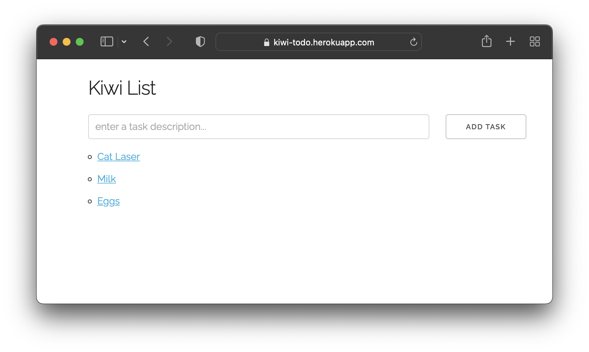

[](https://github.com/atharvakale343/kiwi-todo/actions/workflows/ci.yml)
# Todo App built with Rocket

This repository is a fork of a basic Todo app from [Rocket Examples](https://github.com/SergioBenitez/Rocket/tree/master/examples/todo)

[View the App Website](http://kiwi-todo.herokuapp.com/)



# Develop Locally

In Bash on macOS:
```console
brew install postgresql

mkdir db

initdb db

pg_ctl -D db/ start

createdb

echo 'DATABASE_URL=postgres://' $'\n''ROCKET_DATABASES="{postgres_database={url=\"${DATABASE_URL}\", pool_size=1, timeout=20}}"' > .env

cargo run
```

If `cargo run` cannot link with `-lpq`, then:
```console
brew install libpq && brew link --force libpq

cargo run
```
